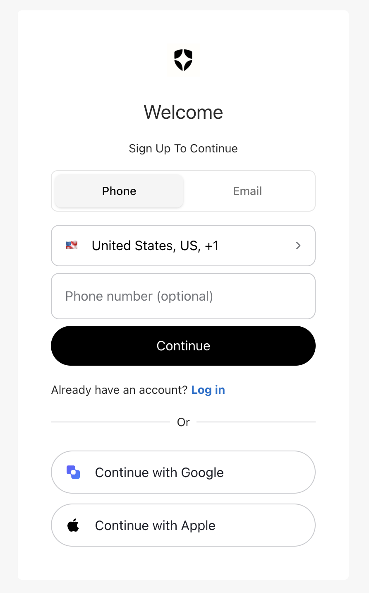
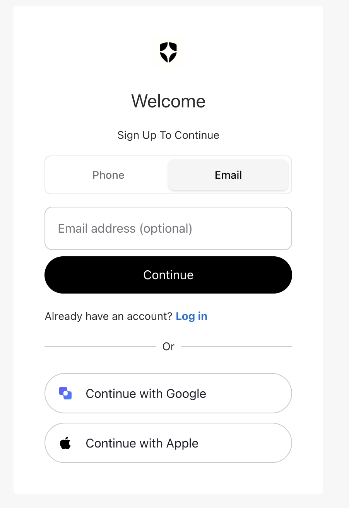

# Add a Phone / Email Toggle to Your Auth0 ACUL Sign-Up Screen

In the [previous tutorial](auth0-acul-signup-id-tutorial.md) we built a phone-first `signup-id` screen that hid email behind a **"Continue with Email"** button in the OR section. This quick-start shows an alternative branding for the same screen: a **pill toggle** at the top of the form that flips between phone and email in place.

- **One clean view** — a two-segment Phone / Email switch, not a field picker buried under "OR"
- **Phone active by default**, one tap to switch to email (and back)
- **Social logins stay put** — Google, Apple, etc. render below the form, unchanged
- **~3 files changed** — the toggle state moves into the form; the OR section becomes social-only

> **Who is this for?** Developers who already have an Auth0 ACUL `signup-id` project (see the [full setup tutorial](auth0-acul-signup-id-tutorial.md) if you don't). You should be comfortable with React + Tailwind.
>
> **Finished code:** [github.com/varnerstanley/auth0-custom-login](https://github.com/varnerstanley/auth0-custom-login) — the pill toggle is the live `signup-id` design.

---

## Prerequisites

You already have a scaffolded ACUL project with the `signup-id` screen — i.e. you've run:

```bash
auth0 acul init auth0-custom-login \
  --template "React (with ACUL React SDK)" \
  --screens signup-id
```

and your mock context (`public/screens/signup/signup-id/default.json`) enables **both** phone and email identifiers plus a couple of social connections. If any of that is new, do [Steps 1–5 of the setup tutorial](auth0-acul-signup-id-tutorial.md) first, then come back here.

---

## The idea

The whole design comes down to one piece of state:

```ts
type IdentifierMode = "phone" | "email";
```

- The **form owns** `identifierMode` (in the button-based approach, the screen root owned it).
- A **pill toggle** at the top of the form flips that state.
- The form renders **only the active identifier's fields** — so switching is instant, in place, with no page movement.
- Because the switch is now inside the form, `AlternativeLogins` no longer needs it — it goes back to rendering just social connections.

Three files change: `SignupIdForm.tsx` (gets the toggle + owns the state), `AlternativeLogins.tsx` (social-only), and `index.tsx` (drops the shared state).

---

## Step 1 — `SignupIdForm.tsx`: own the state, render the toggle

Replace `src/screens/signup-id/components/SignupIdForm.tsx` with this. The two things to notice: the `useState` near the top, and the pill-toggle JSX just above the field rendering.

```tsx
import { useMemo, useState } from "react";
import { useForm } from "react-hook-form";

import {
  useErrors,
  useSignupIdentifiers,
  useUsernameValidation,
} from "@auth0/auth0-acul-react/signup-id";
import type {
  ErrorItem,
  IdentifierType,
  SignupOptions,
  UsernameValidationResult,
} from "@auth0/auth0-acul-react/types";

import Captcha from "@/components/Captcha/index";
import { ULThemeFloatingLabelField } from "@/components/form/ULThemeFloatingLabelField";
import { ULThemeFormMessage } from "@/components/form/ULThemeFormMessage";
import { Form, FormField, FormItem } from "@/components/ui/form";
import { ULThemeButton } from "@/components/ULThemeButton";
import ULThemeCountryCodePicker from "@/components/ULThemeCountryCodePicker";
import { ULThemeAlert, ULThemeAlertTitle } from "@/components/ULThemeError";
import { useCaptcha } from "@/hooks/useCaptcha";
import { transformAuth0CountryCode } from "@/utils/helpers/countryUtils";
import { getIndividualIdentifierDetails } from "@/utils/helpers/identifierUtils";
import { createUsernameValidator } from "@/utils/validations";

import { useSignupIdManager } from "../hooks/useSignupIdManager";

type IdentifierMode = "phone" | "email";

function SignupIdForm() {
  const {
    transaction,
    handleSignup,
    handlePickCountryCode,
    isCaptchaAvailable,
    texts,
    captcha,
    locales,
  } = useSignupIdManager();

  const { errors, hasError, dismiss } = useErrors();

  // Which identifiers has the tenant enabled?
  const enabledIdentifiers = useSignupIdentifiers();
  const hasPhone = enabledIdentifiers?.some((id) => id.type === "phone") ?? false;
  const hasEmail = enabledIdentifiers?.some((id) => id.type === "email") ?? false;

  // The toggle state lives here. Default to phone when it's available.
  const [identifierMode, setIdentifierMode] = useState<IdentifierMode>(
    hasPhone ? "phone" : "email"
  );

  const form = useForm<SignupOptions>({
    defaultValues: { email: "", username: "", phone: "", captcha: "" },
    reValidateMode: "onBlur",
  });

  const {
    formState: { isSubmitting },
    watch,
  } = form;

  const userNameValue = watch("username");
  const {
    isValid: isUsernameValid,
    errors: userNameErrors,
  }: UsernameValidationResult = useUsernameValidation(userNameValue || "");

  const requiredIdentifiers = useMemo(
    () =>
      (enabledIdentifiers || [])
        .filter((identifier) => identifier.required)
        .map((identifier) => identifier.type),
    [enabledIdentifiers]
  );

  const optionalIdentifiers = useMemo(
    () =>
      (enabledIdentifiers || [])
        .filter((identifier) => !identifier.required)
        .map((identifier) => identifier.type),
    [enabledIdentifiers]
  );

  const buttonText = texts?.buttonText || locales.form.button;
  const captchaLabel = texts?.captchaCodePlaceholder
    ? `${texts.captchaCodePlaceholder}*`
    : `${locales.form.fields.captcha.label}*`;

  const { captchaConfig, captchaProps } = useCaptcha(
    captcha || undefined,
    captchaLabel
  );

  const generalErrors: ErrorItem[] = errors
    .byType("auth0")
    .filter((err) => !err.field);

  const captchaSDKError = errors.byField("captcha")[0]?.message;

  const onSubmit = async (data: SignupOptions) => {
    await handleSignup(data);
  };

  const renderIdentifierField = (
    identifierType: IdentifierType,
    isRequired: boolean
  ) => {
    const { label, type, autoComplete } = getIndividualIdentifierDetails(
      identifierType,
      isRequired,
      texts
    );

    const sdkError = errors.byField(identifierType)[0]?.message;

    return (
      <FormField
        key={identifierType}
        control={form.control}
        name={identifierType}
        rules={{
          required: isRequired ? locales.form.fields.common.required : false,
          ...(identifierType === "username" && {
            validate: createUsernameValidator(
              isUsernameValid,
              userNameErrors,
              isRequired,
              locales.form.fields.common.required
            ),
          }),
        }}
        render={({ field, fieldState }) => (
          <FormItem>
            <ULThemeFloatingLabelField
              {...field}
              label={label}
              type={type}
              autoComplete={autoComplete}
              error={!!fieldState.error || !!sdkError}
            />
            <ULThemeFormMessage
              sdkError={sdkError}
              hasFormError={!!fieldState.error}
            />
          </FormItem>
        )}
      />
    );
  };

  const renderFields = (identifiers: IdentifierType[], isRequired: boolean) =>
    identifiers.map((identifierType) => {
      if (identifierType === "phone") {
        const phoneCountryCode = transformAuth0CountryCode(
          transaction?.countryCode,
          transaction?.countryPrefix
        );

        return (
          <div
            key={`${isRequired ? "required" : "optional"}-phone-container`}
            className="space-y-2"
          >
            <ULThemeCountryCodePicker
              selectedCountry={phoneCountryCode}
              onClick={handlePickCountryCode}
              fullWidth
              placeholder={locales.form.fields.countryCode.placeholder}
            />
            {renderIdentifierField(identifierType, isRequired)}
          </div>
        );
      }
      return renderIdentifierField(identifierType, isRequired);
    });

  return (
    <Form {...form}>
      <form onSubmit={form.handleSubmit(onSubmit)}>
        {hasError && generalErrors.length > 0 && (
          <div className="space-y-3 mb-4">
            {generalErrors.map((error) => (
              <ULThemeAlert
                key={error.id}
                variant="destructive"
                onDismiss={() => dismiss(error.id)}
              >
                <ULThemeAlertTitle>{error.message}</ULThemeAlertTitle>
              </ULThemeAlert>
            ))}
          </div>
        )}

        {/* Pill toggle — only when both identifiers are available */}
        {hasPhone && hasEmail && (
          <div className="mb-4">
            <div className="grid grid-cols-2 rounded-md border border-input bg-background p-1">
              <button
                type="button"
                onClick={() => setIdentifierMode("phone")}
                className={[
                  "h-10 rounded-md text-sm font-medium transition",
                  identifierMode === "phone"
                    ? "bg-muted text-foreground shadow-sm"
                    : "bg-transparent text-muted-foreground hover:text-foreground",
                ].join(" ")}
              >
                Phone
              </button>
              <button
                type="button"
                onClick={() => setIdentifierMode("email")}
                className={[
                  "h-10 rounded-md text-sm font-medium transition",
                  identifierMode === "email"
                    ? "bg-muted text-foreground shadow-sm"
                    : "bg-transparent text-muted-foreground hover:text-foreground",
                ].join(" ")}
              >
                Email
              </button>
            </div>
          </div>
        )}

        {/* Render only the active identifier's fields */}
        {identifierMode === "phone"
          ? renderFields(requiredIdentifiers.filter((id) => id !== "email"), true)
          : renderFields(requiredIdentifiers.includes("email") ? ["email"] : [], requiredIdentifiers.includes("email"))}
        {identifierMode === "phone"
          ? renderFields(optionalIdentifiers.filter((id) => id !== "email"), false)
          : renderFields(!requiredIdentifiers.includes("email") ? ["email"] : [], false)}

        {isCaptchaAvailable && captchaConfig && (
          <Captcha
            control={form.control}
            name="captcha"
            captcha={captchaConfig}
            {...captchaProps}
            sdkError={captchaSDKError}
            rules={{ required: locales.form.fields.captcha.required }}
          />
        )}

        <ULThemeButton type="submit" className="w-full" disabled={isSubmitting}>
          {buttonText}
        </ULThemeButton>
      </form>
    </Form>
  );
}

export default SignupIdForm;
```

> **Why keep the `renderFields(... .filter((id) => id !== "email"))` logic?** It shows exactly one identifier at a time. Phone mode shows phone (+ any non-email fields like username); email mode shows only email. That filtering is what makes the toggle swap the field cleanly instead of stacking both.

---

## Step 2 — `AlternativeLogins.tsx`: social-only, no props

Now that the form owns the switch, this component goes back to just rendering social connections. Replace `src/screens/signup-id/components/AlternativeLogins.tsx`:

```tsx
import ULThemeSocialProviderButton from "@/components/ULThemeSocialProviderButton";
import type { SocialConnection } from "@/utils/helpers/socialUtils";
import { getSocialProviderDetails } from "@/utils/helpers/socialUtils";

import { useSignupIdManager } from "../hooks/useSignupIdManager";

// Phone/email switching lives in the form's pill toggle, so this component only
// renders social provider connections (Google, Apple, etc.).
const AlternativeLogins = () => {
  const { alternateConnections, handleFederatedSignup, locales } =
    useSignupIdManager();

  const handleConnectionSignup = (connection: SocialConnection) => {
    handleFederatedSignup({
      connection: connection.name,
      ...(connection.metadata || {}),
    });
  };

  if (!alternateConnections || alternateConnections.length === 0) {
    return null;
  }

  return (
    <div className="space-y-3 mt-2">
      {alternateConnections.map((connection: SocialConnection) => {
        if (!connection?.name) return null;
        const { displayName, iconComponent } = getSocialProviderDetails(connection);
        return (
          <ULThemeSocialProviderButton
            key={connection.name}
            displayName={displayName}
            buttonText={`${locales.social.continueWith} ${displayName}`}
            iconComponent={iconComponent}
            onClick={() => handleConnectionSignup(connection)}
          />
        );
      })}
    </div>
  );
};

export default AlternativeLogins;
```

> **Bonus:** this version takes no props, so the `MFAEmailIcon` / `MFAPhoneIcon` imports and the `IdentifierMode` import disappear — one less thing to wire up.

---

## Step 3 — `index.tsx`: drop the shared state

The screen root no longer manages `identifierMode`. It also only shows the "OR" separator when there are social connections to divide from the form. Replace `src/screens/signup-id/index.tsx`:

```tsx
import ULThemeCard from "@/components/ULThemeCard";
import ULThemePageLayout from "@/components/ULThemePageLayout";
import ULThemeSeparator from "@/components/ULThemeSeparator";
import { extractTokenValue } from "@/utils/helpers/tokenUtils";
import { applyAuth0Theme } from "@/utils/theme/themeEngine";

import AlternativeLogins from "./components/AlternativeLogins";
import Footer from "./components/Footer";
import Header from "./components/Header";
import SignupIdForm from "./components/SignupIdForm";
import { useSignupIdManager } from "./hooks/useSignupIdManager";

function SignupIdScreen() {
  const { signupId, texts, alternateConnections, locales } =
    useSignupIdManager();

  // Phone/email switching lives in the form's pill toggle, so the separator
  // only appears when there are social connections to divide from the form.
  const showSeparator = alternateConnections && alternateConnections.length > 0;

  const separatorText = texts?.separatorText || locales.page.separator;
  document.title = texts?.pageTitle || locales.page.title;

  applyAuth0Theme(signupId);

  const socialLoginAlignment =
    extractTokenValue("--ul-theme-widget-social-buttons-layout") || "bottom";

  const renderSocialLogins = (alignment: "top" | "bottom") => (
    <>
      {alignment === "bottom" && showSeparator && (
        <ULThemeSeparator text={separatorText} />
      )}
      <AlternativeLogins />
      {alignment === "top" && showSeparator && (
        <ULThemeSeparator text={separatorText} />
      )}
    </>
  );

  return (
    <ULThemePageLayout className="theme-universal">
      <ULThemeCard className="w-full max-w-[400px] gap-0">
        <Header />
        {socialLoginAlignment === "top" && renderSocialLogins("top")}
        <SignupIdForm />
        <Footer />
        {socialLoginAlignment === "bottom" && renderSocialLogins("bottom")}
      </ULThemeCard>
    </ULThemePageLayout>
  );
}

export default SignupIdScreen;
```

> If your old `index.tsx` had `export type IdentifierMode`, you can delete it — nothing imports it anymore (the form now defines its own local `IdentifierMode`).

---

## Step 4 — The toggle styling, on brand

The toggle is a plain two-button grid styled with the project's semantic Tailwind tokens — the same ones the UL theme wires to Auth0's branding variables. That means the toggle automatically picks up your tenant's colors, radius, and font.

```tsx
{/* the track */}
<div className="grid grid-cols-2 rounded-md border border-input bg-background p-1">

{/* active segment */}
className="h-10 rounded-md text-sm font-medium transition
           bg-muted text-foreground shadow-sm"

{/* inactive segment */}
className="h-10 rounded-md text-sm font-medium transition
           bg-transparent text-muted-foreground hover:text-foreground"
```

| Token | Role | Comes from |
|---|---|---|
| `bg-background` / `border-input` | the toggle track | UL theme base surface + border |
| `bg-muted` + `shadow-sm` | the selected pill | UL theme muted surface (the "raised" look) |
| `text-foreground` | active label | primary text color |
| `text-muted-foreground` | inactive label | secondary text color |

Because these are tokens (not hard-coded hex), you don't restyle anything to match a new tenant — set your colors in **Branding → Universal Login** and the toggle follows. To tweak the shape, change `rounded-md` on both the track and the segments; for a taller control, bump `h-10`.

---

## Step 5 — Preview and verify

```bash
cd auth0-custom-login
auth0 acul dev
```

In the Context Inspector: **Screen** → `signup / signup-id`, **Data source** → `Local development`, then close the panel.

You should see:

- A **Phone | Email** toggle with **Phone** selected
- The country-code picker + phone field below it
- Google / Apple buttons under an **OR** separator

Click **Email** — the phone field is replaced in place by the email field, and the **Email** segment becomes the raised/active one. Click **Phone** to switch back.




> The toggle only renders when the tenant has **both** phone and email enabled (`hasPhone && hasEmail`). With a single identifier, there's nothing to switch, so the form just shows that one field — no empty toggle.

---

## Recap

| File | Change |
|---|---|
| `SignupIdForm.tsx` | Owns `identifierMode` state; renders the pill toggle; shows only the active identifier's fields |
| `AlternativeLogins.tsx` | Back to social-only (no props); dropped the email/phone buttons and MFA icon imports |
| `index.tsx` | No shared `identifierMode`; separator shows only when social connections exist |

That's the whole toggle. Everything else — the country picker, captcha, submit handling, social sign-up — is untouched.

---

## Taking it further

- **Prefill + auto-submit (passkey hand-off)** — pass `ext-email`/`ext-phone` + `ext-passkey=true` to `/authorize`, read them from `untrustedData.authorizationParams` in `useSignupIdManager`, initialize `identifierMode` to the prefilled identifier, and auto-submit on mount so the user lands straight on passkey enrollment. The [reference repo](https://github.com/varnerstanley/auth0-custom-login) has this wired up.
- **Same toggle on `login-id`** — identical pattern; swap the SDK import to `@auth0/auth0-acul-react/login-id`.
- **Deploy** — `npm run build`, push `dist/` to your CDN, and register the asset URLs with Auth0 (see [Deployment Workflow](https://auth0.com/docs/customize/login-pages/advanced-customizations/deployment-workflow)).
